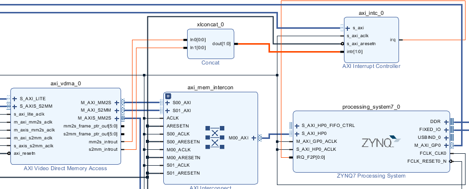

AXI-Stream Video Test Pattern Sender, HLS Version
=================================================

### システム作成方法の補足

Vitis HLS でパターン送信回路の IP コアが作成できたら、その IP コアのあるディレクトリを Vivado のプロジェクト設定で IP Repository に追加してください．

その後の基本的なハードウェアの作成方法は、<a href="https://github.com/nfproc/hdmi_sender">SystemVerilog 版</a>とほぼ同様です。<a href="https://github.com/Digilent/vivado-library/">Digilent 社の IP コアライブラリ</a>から rgb2dvi コア (ip/rgb2dvi) と TMDS インタフェース (if/tmds) をダウンロードし、これらを含むディレクトリも IP Repository に追加してください。

ブロック図の作成においては、PYNQ のライブラリとの整合を取るため、割込み関係のピンを接続する必要があります。ZYNQ7 Processing System の設定で、Interrupts ページの Fabric Interrupts → IRQ_F2P にチェックを入れてください。その後、Concat と AXI Interrupt Controller を1つずつ配置し、AXI VDMA の割込み出力 (mm2s_introut, s2mm_introut) を下図のように接続してください。

AXI Interrupt Controller の残りの接続線は Run Connection Automation で作成します。